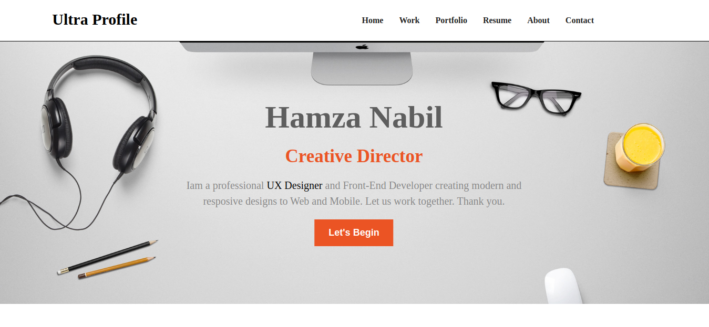

# [Preview](https://khali70.github.io/react-templat/)

this is a react project form [hamza Nabil channal](https://www.youtube.com/channel/UCq_xgufsy1KrGsmJq7mFH-g)

click the [link](https://khali70.github.io/react-templat/) to see the website

# Environment

to use this app you need

- [nodejs](https://nodejs.org/)
- [yarn](https://yarnpkg.com/lang/en/docs/install/)

# How to use

1. open the project in the terminal or CMD
2. run command `yarn install`
3. then `yarn start`
4. Open [http://localhost:3000](http://localhost:3000) to view it in the browser.
